<!--

Version 2.0 (Criminal Division)

 -->
# TT.jim - The Court Case Management System

## Copyright

Copyright &copy; 2021 Judiciary of Trinidad and Tobago.

No part of this publication may be reproduced, distributed, or transmitted in any form or by any means, including photocopying, recording, or other electronic or mechanical methods, without the prior written permission of the publisher, except in the case of brief quotations embodied in reviews and certain other non-commercial uses permitted by copyright law.

## Acknowledgements

The current iteration of this manual would not have been possible without original efforts of Ms. Rhea Seegobin from the Judiciary's Family and Children Division. It is the manual from the Family and Children's Division that this Criminal Division manual is modeled on and aspired to be like.

Additionally, thanks is also extended to the National Center for States Court (NCSC) who have always been with us throughout every step of this process in the development of TT.jim.

## Introduction

TT.jim is the new Court Case Management Software, which will replace the Judicial Enforcement Management System (JEMS) introduced in 1993, and is being rolled out to all the courts. TT.jim was launched at the inauguration of the Children Court, in 2018, and is currently in use there. This is the outcome of the MOU signed by Chief Justice Archie with the Supreme Court of Nigeria and the US National Center for State Courts.

## Welcome

Welcome to training of the TT.jim system (Criminal Divison). TT.jim is another step in the modernization and digitalization of the Judiciary of Trinidad and Tobago. TT.jim will soon be the central point of management for all court related activities from creating cases, assigning judges and tracking payments and disbursements. Let's get started!

# How to Login to TT.jim

To login to TT.jim, on the desktop of your Judiciary computer, double click the TT.jim icon. 

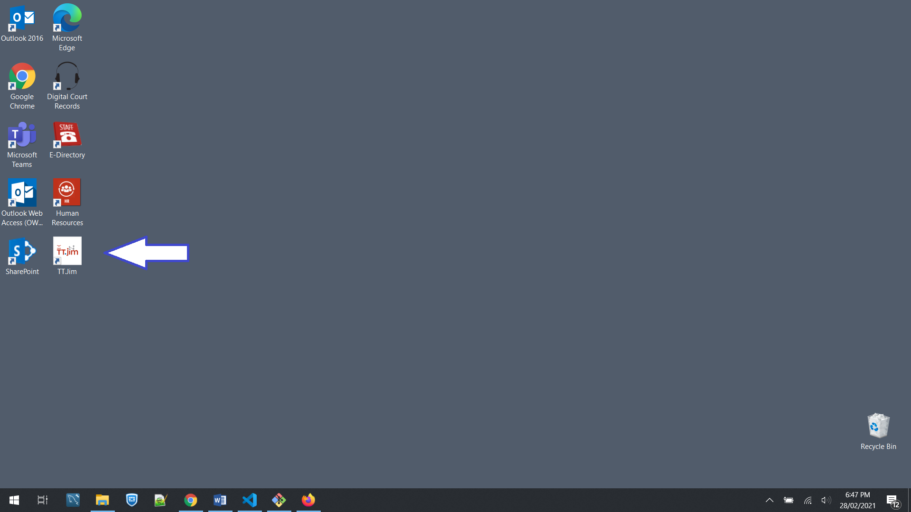

This will bring up the TT.jim website (see below). From here select the relevant court which would take you to the login screen to start using TT.jim.

Alternatively, you can open a Chrome browser and navigate to the following URL: https://criminal.ttlawcourts.org/.

Enter your username and password on the left side of the screen. The default username and password are a combination of your first initial in your first name and your last name. This username will be same as your Active Directory User Name. The password will be provided to you but the IT Help Desk.

Enter your credentials and click/tap the *LOG IN* button.

The initial screen that greets you upon a successful login should resemble image below.

At the top right, you will see the name of the person that is currently logged in and the court to which he/she is currently logged into.

If a user is assigned to multiple courts, the user can change the active court by selecting the desired court from the drop down list at the top right.

# Searching for a Party

The *parties* to a case should be created before creating the actual case. Before attempting to create a party, the user should **ALWAYS** search TT.jim for the prospected party before entering it into the system. This practice prevents duplicate parties being entered into the Court Case Management System (CCMS). Duplicate entries should be avoided because Parties cannot be deleted from the system. This is a transparency feature implemented for auditing purposes.

To search for a party, go to the party tab and select &quot;Search Party&quot;

Enter the first name or last name or full name of the party you are looking for. You can even search using a party's alias. Click enter to complete your search.

The reset button clears the fields in preparation for another search.

If the user does not exist, the system would return zero results found.

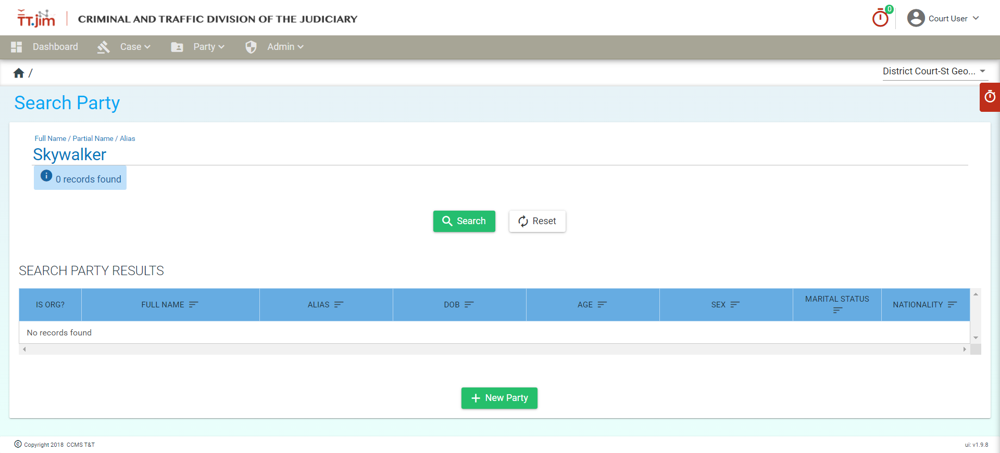

If there were no result found, then you should go ahead and create the needed parties in preparation for case creation.

# Creating a Party in TTJim

The BASIC pieces of information needed to create a party are the Given Name and the Family Name (i.e. First Name/Last Name).

Additional information can be entered at a later date. This will help to minimize the time a customer spends at the counter.

Please ensure that all applicable information is stored for every party.

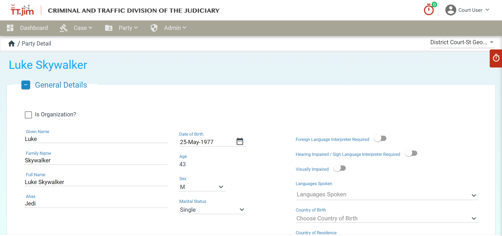

Click the save button to create the party.

Upon party creation, proceed to add the relevant bio data such as Employment History / Occupation, Identifiers, Email Addresses, Phone Numbers and Addresses.

TT.jim allows for multiple sets of bio data to be affixed to a particular party in addition to the mandatory general details. See the image below.

To enter information into the bio data categories, click/tap the plus sign on the left of the category to expand the category box and expose the input fields to enter the party's information.

These bio data fields will have a start date and end date. The start date is the period from when the specific information that was entered is active or relevant. E.g. a party getting a new SIM card would have their phone number start date as they day their SIM was activated. The Start Date field is mandatory. The End Date field records information that is expired or no longer relevant. E.g. a person changed addresses. Then end date field is not mandatory.

When you have finished entering the relevant information, ensure you click/tap the save button to confirm the added/updated information. 

## Adding Employment / Occupation Information

To add Employment/Occupation information, expand the relevant category box. The system only accepts predefined occupations that can be exposed by clicking the dropdown arrow on the Occupation Title input field. This title field supports the type-ahead option that filters the occupations as you type. The system does not have an "UNEMPLOYED" option as of this time.

The fields that are mandatory for saving an occupation in the system are:

1. Occupation Title
2. Employment Status
3. Start Date

## Adding Identifiers

To add identifiers, expand the relevant category box. Identifiers are used to store government and other professionally issued forms of identification for a party. Use the dropdown menu to select the relevant identifier to the party. You can add multiple identifiers to a party.

The fields that are mandatory for saving an identifier in the system are:

1. Identifier Type
2. Identifier Value
3. Start Date (Date of Issue of ID)

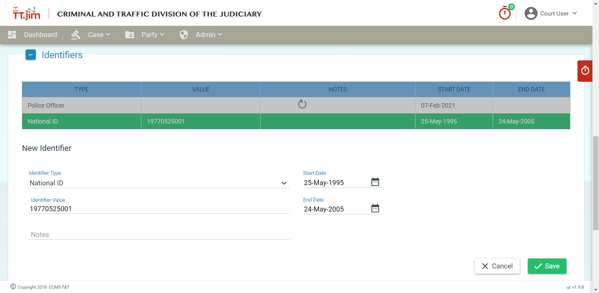

## Adding Email Addresses

To add an Email Address, ensure the email is in the correct format (e.g. jdoe@example.com). You can add multiple email addresses to a party.

The fields that are mandatory for saving an email address in the system are:

1. Email Type
2. Email Address
3. Start Date (Today's Date)

## Adding Phone Numbers

To add a phone number, enter the number without any dashes or spaces.
You can add multiple phone numbers to a party.

The fields that are mandatory for saving an email address in the system are:

1. Phone Type
2. Phone Number
3. Start Date

## Adding Addresses

To add an address, simply input the information indicated in the input field's title. If (and only if) Trinidad and Tobago is selected as a country, the City/Town dropmenu then becomes active. After a City/Town is selected TT.jim will then automatically populate the Community Code, Administrative Area and Postal Code fields. You then have to enter in the remaining required fields (see list below) to before the system will allow the address to be entered/updated.

The fields that are mandatory for saving an address in the system are:

1. LP# / House Number
2. Community Code – provided by Central Statistical Office
3. Administrative Area - provided by Central Statistical Office
4. Postal Code – provided by the postal service
5. City / Town
6. Country
7. Description – This field will be helpful to a Marshall when he/she is delivering a summons.
8. Start Date

# Searching for a Case in TT.jim

Before attempting to create a case, the user should **ALWAYS** search TT.jim for any existing case(s) for the Applicant/Petitioner in question. This practice prevents duplicate cases being entered into the Court Case Management System (CCMS). Duplicate entries should be avoided because cases cannot be deleted from the system. This is a transparency feature implemented for auditing purposes.

To search for a case, go to the *Case* tab and select &quot;Search Case&quot;. The system performs various types of case searches as seen below:

1. A full or partial case number. Entering SGW-1-2020 and CR-DC-SGW-1-2020 will yield the same search results.

2. A combination search using a party&#39;s name and the party&#39;s role in the case. This search will return all cases where the party&#39;s name is &quot;Mark&quot; and the role is &quot;Complainant&quot;.

3. The system can return all cases of a specific case type.

4. Another combination search can be performed to return all cases that are of a specific case type and case phase.

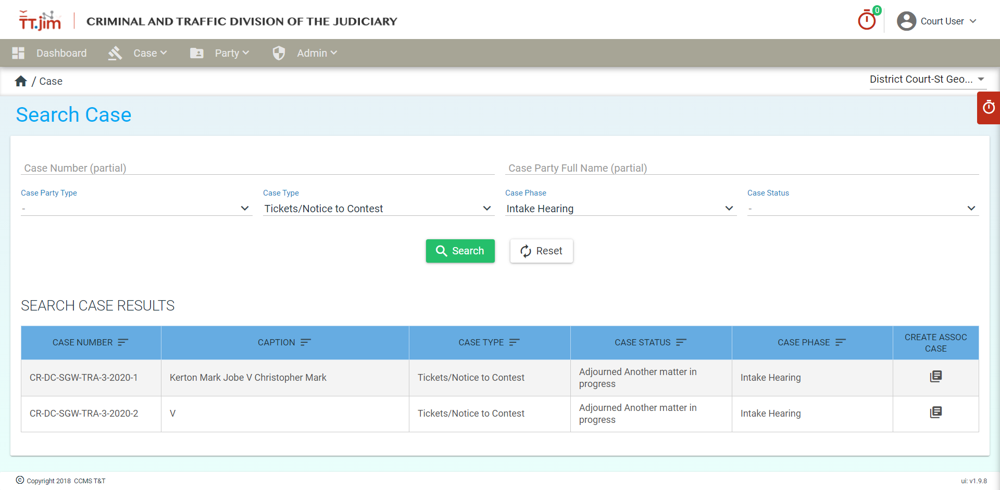

5. The system can also return all cases with a specific case status.

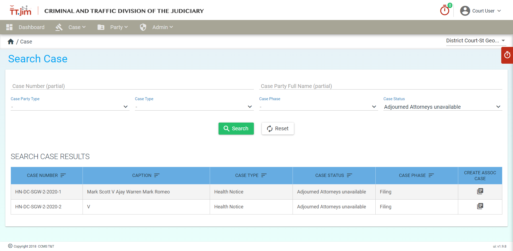

# Creating a Case in TT.jim

A case is the main module in TT.jim. Before creating case **ALWAYS** search to see if a relevant case already exist. See [Case Search](#searching-for-a-case-in-tt.jim) above for more information.

The basic details required to a create a case are as follows:

1. Filing Date – This field can be back dated if needed
2. Case Weight
3. Case Status
4. Case Type
5. Case Phase
6. Case Sub Type
7. Case Party of type Applicant / Accused

See below to view the interface for creating a case. Parties to a case can be added using the *Add Case Party* button from this interface.

### Add a Party to a Case
The "Add Case Party" window allows you to add an existing party or create a new party directly from the interface. It is recommended that you [create parties](#creating-a-party-in-ttjim) to a case prior to creating a case.

If adding an existing party (recommended), you can search for the party directly from this interface. The search feature also supports partial name matches, thus you do not need to enter the entire name to conduct a search. Click/Tap the button with the magnifying glass to run the search after entering a full/partial search phrase. If the intended party is present, click/tap the relevant party and assign a Party Role and Start Date for the found party.

You can add an existing party or create a new party from this interface. It is best practice to create all parties relating to a case, before creating the case. When the desired parties are found and selected, assign a Party Role (E.g. Accused/Defendant) and click the button &#39;Add Party to Case&#39;.

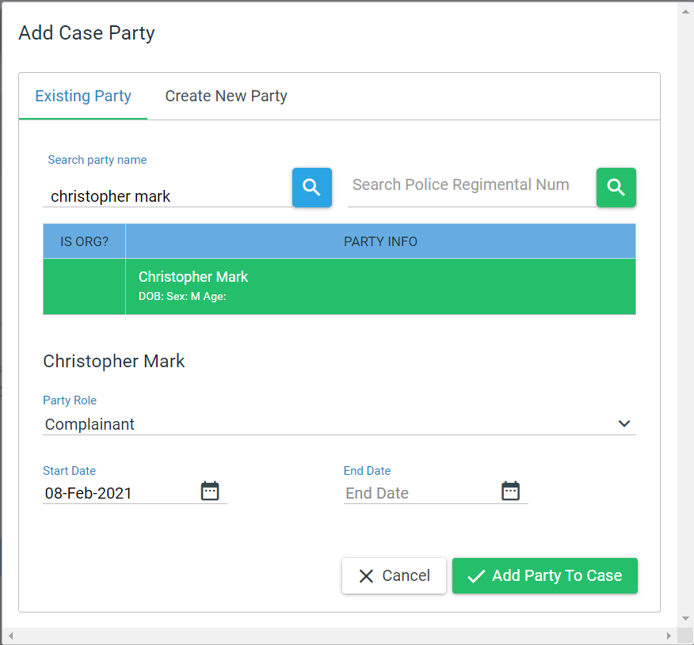

The party, party role and start date must be entered, otherwise the system would not be able to create a case.

Once the button &quot;Add Party To Case&quot; is clicked, the case will be created.

 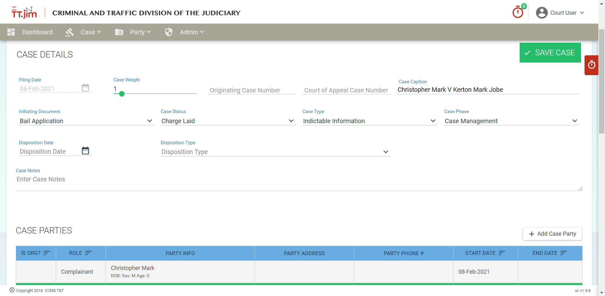

You can proceed to add as many parties to a case as required. Start and End dates can be used to track active parties on a case. For example, an attorney on a case may change from time to time and the start and end date will indicate the current attorney for the case.

## Creating a Case Application

Many applications can be created for the duration of a case. Some of the most common will include applications for granting/updating matters relating to bail.

The figure below shows the application details for an Application for Bail.

 

Saving the application details generate the application number. It is a combination of the case number, application type and the sequence number. The details can be edited if needed.

## Add Charges to a Case

You can add the relevent charges for a case by scrolling down to the CHARGES section and clicking on the "Add Charge" button

A form will appear, allowing you to enter the relevant information about the charge such as the Local Charge, Charge Description, Police Description, etc.

After filling out the form, click "Save" and the new charge will appear in list of charges. Note that the charges will not be officially added to the case, until you click on "Save Case"

Multiple Charges cannot be added at the same time. You must save each charge one by one when adding them to a case

## Case Sentencing/Consequences

Case Sentencing and Consequences information can be managed in the Sentencing tab at the bottom of the case form.

To add a new consequence, click on the "Add Consequence" button. A form will appear, allowing you to choose from a list of consequences.

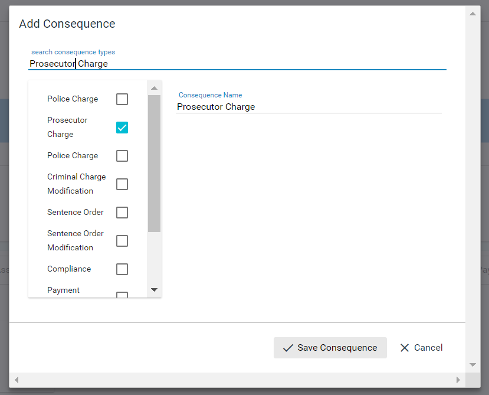

Select the consquence you wish to add, and click "Save Consequence". The newly added consequence will appear in the list. To add further details to the newly added consequence, select it in the list, and the list of details you can edit will appear on the right

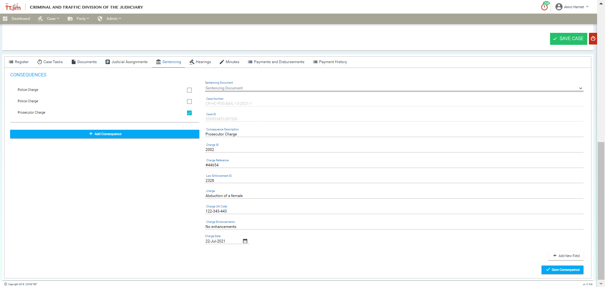

You also have the option of adding a field of a specific type, that you wish to tie to the consequence in order to add on other details. To do this you click on "Add Field" on the bottom right.

You can specify the field name, and select from the list of data types from the list below. Then you can click "Save Consequence" to save the consequence and the details you've entered in the form

# Case Sealing

Some cases are more sensitive than others. Recognizing this fact, TT.jim allows the option to seal a case, thus restricting access to designated parties. By default, the parties with access to view a sealed case are the Judicial Officers assigned to the case and Registrars of the court.

Registrars are responsible for managing sealed cases. Only a Registrar has permission to seal/unseal a case. Registrars can also add/remove users to a case. After being granted authorization by a Registrar, these users will then be able to access sealed cases.

When searching cases, if a case is sealed, only the Case ID is displayed in the search results while all other fields are marked as *Case Sealed*. To view a sealed case, select the desired case from the list of cases.

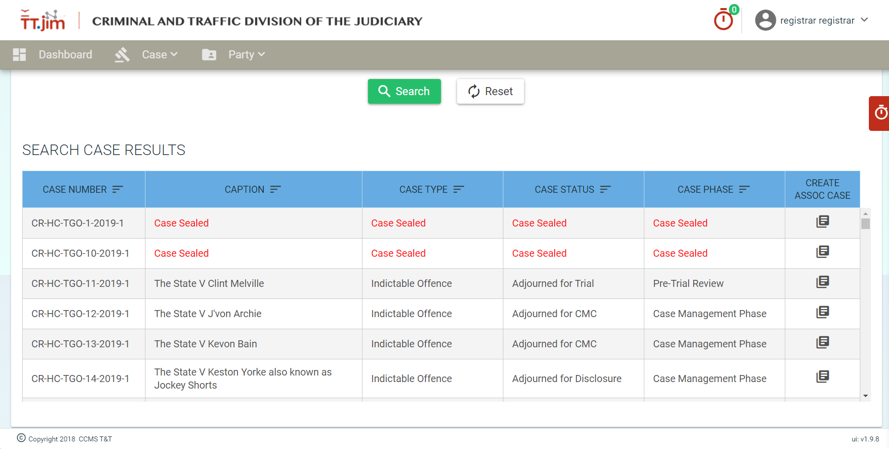

You will be prompted to enter a password to gain authorization to view the case. If have have been assigned permission to view the sealed case in question, simply enter the same password you used to login to TT.jim and you will be take to the case details page of the sealed case.

## How to Seal/Unseal a Case

To **seal** a case, you must be logged in as a Registrar. The steps are as follows:

1. Click/Tap the "UPDATE ACCESS" button to bring up the Seal Case File windows.

    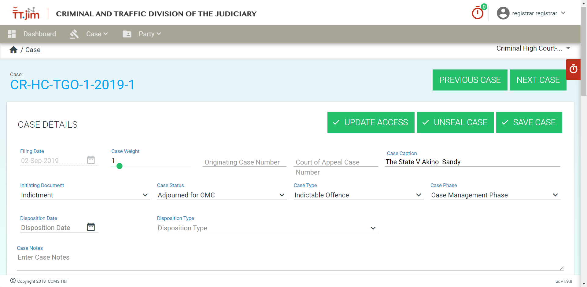

2. Click the "Seal Case" button.

    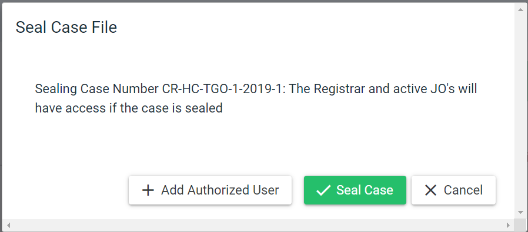

When a case is sealed, A caption in a red font will appear at the top of the case indicating the fact that it is sealed.

To **unseal** a case Click/Tap the "UNSEAL CASE" button.

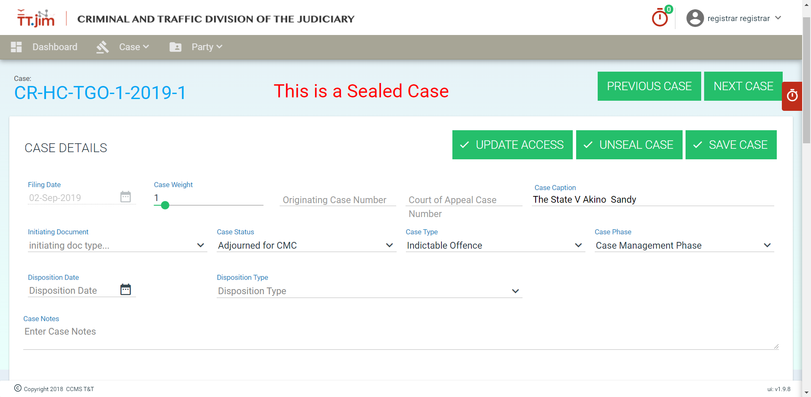

## Authorizing/Deauthorizing Users to View Sealed Cases

Judicial Officers assigned to the case as well as Registrars can view a sealed case by default. Additional users can be authorized to view a case by following the steps below:

1. Click/Tap the "UPDATE ACCESS" button to bring up the Seal Case File windows.

2. Click/Tap the "Add Authorized User" to bring up a list of users.

    

3. Select the user you want to authorize to view the sealed case.

    

4. Click/Tap the "Save Authorized Users" button after you have finished adding all the desired authorized users.

    

# Case Event Register

TT.jim's Event Register allows us to track all changes in a case. The event filter is user friendly and it is type ahead to help a user filter the specific events that he/she is looking to find.

All changes to a case are recorded in the event register which is publicly available to all users in the system.

If the user would like to record a task that was completed but is not automatically recorded by TT.jim, the user can use the "Add Completed Event" feature at the bottom of a case's **Register** tab to manual record a custom task. This will bring up a dialog box as below where the user can input the appropriate task information.

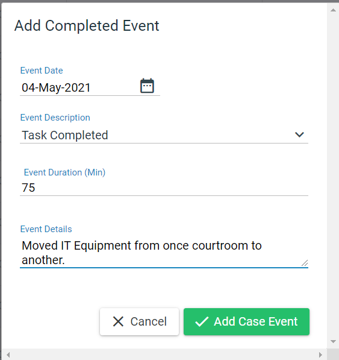

When saved, the information will then be added to the list of task completed in the case's Event Register.

# Case Tasks
<!-- # Manual Task Creation, Assignment and Management -->

Task in TT.jim can be created as a result of an event workflow or be created manually by a supervisor and assigned to a specific group. A group can consist of one or more staff members.

To manually create a task, click/tap the "Add Case Task" button to bring up the "Case Task Details" window. Enter the information as indicated in the input field headings, then click "Save Task" to finalize your entry. When a case is save it will show up in the list of case tasks on the main case page.

When a case task is added it can be assigned to a staff pool. When a task is assigned to a staff pool, all members of that group will be notified of the pending task by having it show up in their workbasket. 

The workbasket is TT.jim's group todo list where a user can view all pending case tasks. It can be accessed by clicking the red clock icon on the far right of the window. Only taks assigned to your group will show up in the workbasket.

While task are assigned to a group, a user can claim responsibility for a task by *checking it out*. When a task is checked out the system will record the person that checked out the task. When a task is checked out this information is visible to all users in the system.

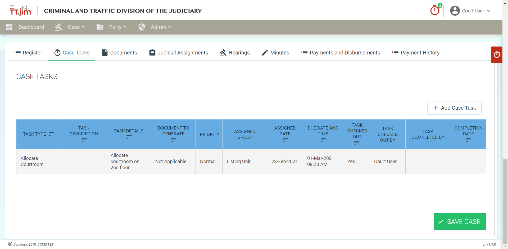

A user that is assigned the role of Court Staff will only be allowed to edit the task details, mark a task as checked out and mark a task a completed.

A supervisor will have the permission to change all the task details prior to the task being marked as completed. When a task is marked as completed the system records the person that completed the task and the date and time that the task was completed

All task details are locked when a task is marked as completed.

# Case Documents

A case can have many documents attached to it. These documents may be generated from a standardized document template or uploaded to the system. When uploading documents to a case the document must be in **PDF** format (i.e. not doc/docx such as Microsoft Word). There are no restrictions on the amount of documents that can be attached to a case. Documents generated/uploaded cannot be removed from the system even if it was attached to a case in error. To add the correct document, a new document must to  generated/uploaded. Both documents will remain on the server auditing purposes and future reference.

## Generating a Court Document

Choosing the document you want to create for a case is simple. Select it from the Generate Document drop down menu on the left. When you have finished selecting the correct one click the Generate button.

 

<!--  -->

Microsoft word will automatically open up and the template document would come up. Click on the &#39;Enable Editing&#39; button.

<!--  -->

The particulars can be entered into the word document. Hitting the tab key will keep moving to the fields that need to be filled in. When you are finished do not save the document on the machine. You need to upload the document by clicking on the macro button.

<!--  -->

<!--  -->

Click save button to complete the upload. When the document is uploaded successfully, it will show up as a court document in the document listing.

<!-- .  -->

Refresh the browser and search for the document that you just generated.

<!--  -->

Click on the document and it would be opened as a read only PDF file. Changes are not allowed to be made to an order. If a mistake is made, the order has to be regenerated.

## Uploading and Viewing a Document

There are two categories of documents that can be uploaded in TTjim, Filings and Court Documents.

The user needs to select the category and the document type. In this case it is a filing document with the document type "Bail Application".

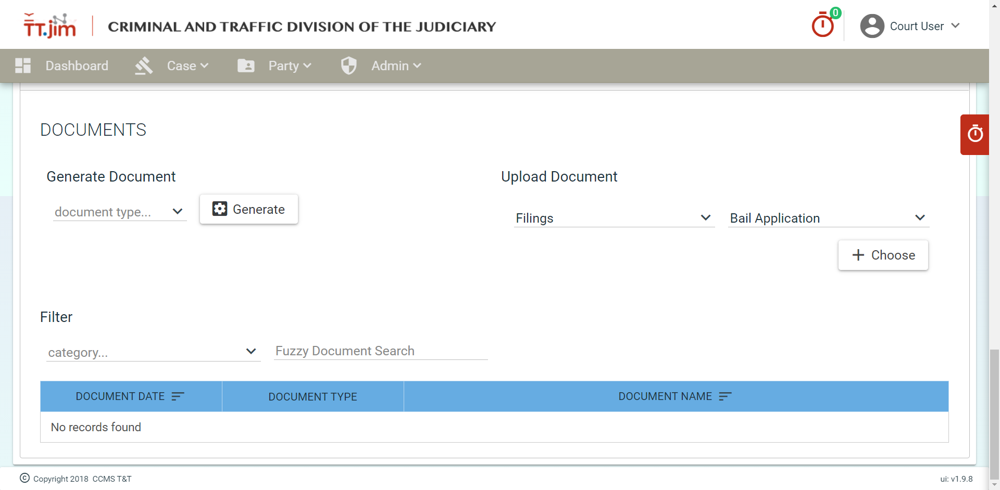

Click on the choose button and select the PDF file that you wish to upload. When the document is uploaded successfully it will show up in the document listing.

Documents can be filtered by the categories, All, Filings and Court Documents.

The system can return all documents with a partial name using the fuzzy search function.

The search below returns all document that are of Filings that contain the word &quot;Petition&quot; in the document name.

In order to view the document, simply click on the document name and it will open as a PDF.

# Case Judicial Assignments

Every case needs to be assigned to a Judicial Officer (JO). Select the tab, , and enter the judicial officer&#39;s start date. If a case is reassigned to a new judicial officer, enter the end date for that particular JO and enter the details for the new JO.

After the judicial officer is saved, it will show up below in the system.

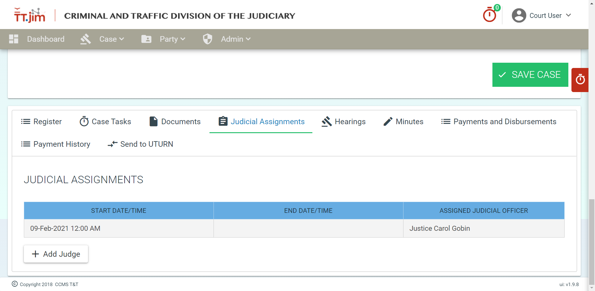

# Case Hearings

Click on the Hearings icon at the bottom of the screen. The details for a hearing can be entered via the Add New Hearing Module. When you are finished entering the details please click on the &quot;Save Hearing&quot; Button.

The hearing will show up as seen below when it has been saved.

# Case Minutes

The mandatory fields needed to add a minute are

1. The hearing date
2. The minute date, automatically populated with the system date and time
3. The judicial officer
4. General Minutes

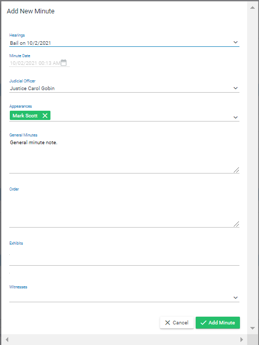

Appearances, Order, Exhibits and witnesses are not mandatory.

After a minute is added to the system, you can edit

1. General Minutes
2. Order
3.

# Case Payments

The payments module is used to record payments in/out of the court. It should be noted that the feature set of the payments module is currently limited to bookkeeping. In other words, the payments module is not used to transfer/receive payments but to record payments/disbursements that were sent/received.

This payment module records payment information such as Payment Methods, Payment Types, Date of Payment and the amount paid.

## Adding a Payment

To add a payment in TT.jim scroll to the bottom of the case and click/tap the *Payments and Disbursements* Tab and then click/tap the *Add Payment* button.

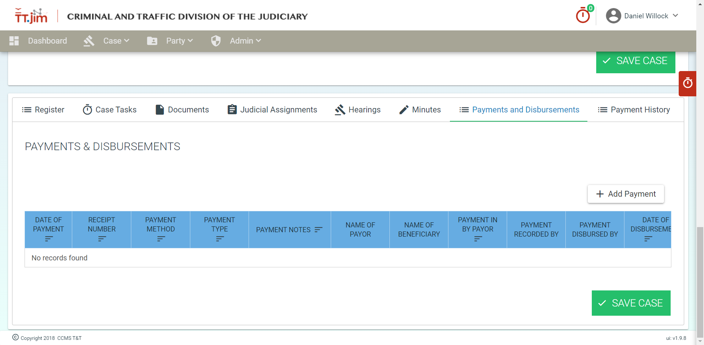

When the Add Payment option is selected the Payment & Disbursement Details window should popup. It is from this window that all the payment details relevant to the case can be entered. See below.

Figure: Processing a payment using CourtPay

While using the payments module, you should take note of the following:

- A processing fee is only displayed for the Payment Method &quot;Court Pay&quot;.
- At least one payment detail must be entered for the payment to be saved in the system.
- The option for disbursement only appears after a payment is saved.
- The total amount paid in by the customer must match the customer payment total in the Payment and Disbursement Details Section. If it does not match you will get a prompt indicating such and the payment will not be saved in TT.jim.

Only when the above criteria are met, can the payment be saved in TT.jim. A court staff user has access to edit the payment details prior to a disbursement. The payment type can only be edited by a supervisor after a payment is entered.

Figure: List of payments added to TT.jim

## Disbursing a Payment in TT.jim

A payment can only be disbursed after it was first [added](#adding-a-payment) to TT.jim. To disburse a payment the user has to select the payment under the Payments and Disbursements tab.

Disbursement options are only shown for the "Compensation" payment type.

Once a disbursement date is entered the disbursement checkbox appears. Select the checkbox and the system will prompt you to verify that you want to disburse this payment

Once this payment is saved, the system records the person that made the disbursement and the date and time that the payment was disbursed.

A supervisor will have the necessary permissions to edit a payment even after it was disbursed. This allows for the correction of any erroneously entered payment information.

## Reimbursing a Payment in TT.jim

A user that is assigned the role of a supervisor will have the permission necessary to reimburse a payment. To reimburse the payment simply uncheck the checkbox, &quot;Payment Disbursed&quot; and the date of disbursement will automatically be set to null and the system will prompt the user to this effect. Click the &quot;save payment&quot; button to complete the reimbursement.

<!--  -->

The fields &quot;Payment Disbursed By&quot; and &quot;Date of Disbursement&quot; will both be set to null to reflect the reimbursement.

The payment history tab shows all the payment details/breakdown for a specific case in the system

<!--  -->

This is updated as additional payments are recorded for a case.

### Payment Detail Updates

The Event Register records all changes to case information including updates to payment information. The event register records payment creation and payment updates. These payment updates are recorded in six categories. See the figure below.

Figure: Registered Payment Events

When a specific filter is applied the payments on that case with the changes are shown in the event register. The system records the date and time that the changes were performed and the user that made the change. This information will be used to track accountability and it will help with the auditing process.

<!--  -->

<!--  -->

# User Administration

TT.jim provides an interface to handle common administration functions from creating users, managing event workflows and reloading lookup tables.

This administrative interface is restricted only to authorized staff users as determined by their assigned roles.

## User Management

The user management interface allows for the searching and creation of staff users on the TT.jim system. It should be noted that this is different from the user profiles that are created using the party tab. Users created in the Admin interface are staff users that would be using the TT.jim system while users created using the Party interface are persons that are related to a court case.

### Searching for a User (Staff):

To search for a user enter a first name or last name in the search box and click/tap the search button. Partial names are also acceptable. The system will then return a list of results that match the search criteria or indicate if no results were found.

### Creating a New User (Staff)

If a user is not found after a search, you should then go ahead and  create a new user. Tap the "New User" button on the User Management page to clear the USER DETAILS fields and scroll down to the now blank USER DETAILS fields.

When creating a staff user, the following fields are required:

1. First Name
    
    The first name of the staff. This will be displayed in the top right of the TT.jim window next to the default user avatar.

2. Last Name

    The last name of the staff. This will be displayed in the top right of the TT.jim window next to the default user avatar.

3. Email Address

    A valid email address that contains the, @, character with an identifier on the left and domain on the right. E.g. jdoe@ttlawcourts.org

4. User Name

    The User Name should reflect the format of the Username in Active Directory. This is used to login to the system.

5. Password

    The password must be at least 6 characters.

6. Confirm Password

    The password must be retyped exactly as in the previous field.

Additionally, a user must be assigned to at least one court and be assigned at least one role in that court before a user can be successfully created. TT.jim supports the following roles:

- Court Staff
- Supervisor
- Court Manager
- Judicial Officer
- IT - Full access
- Registrar
- Sentencing

See the table below for a list of roles, and the functions that each role is able to carry out in TT.jim. 

| Function/Permission | Court Staff | Supervisor | Court Manager | Judicial Officer | IT - Full access | Registrar | Sentencing |
| -------- | ----------- | -----------| ------------- |------------------| -------- | --------- |
| Create Task | No | Yes | Yes | Yes | Yes | Yes |
| Edit Task Details (before being completed) | No (only task checkout and completed fields) | Yes | Yes | Yes | Yes | Yes |
| Edit Payment Method and Receipt Number | No | No | Yes | No | No | No |
| Reimburse Payments | No | Yes | no | No | No | No |
| Create a case | Yes | Yes | No | Yes | Yes | Yes |
| Create a Party | Yes | Yes | No | Yes | Yes | Yes |
| Manage Staff Pools | No | Yes | Yes | No | Yes | No |
| Manage Workflows | No | No | Yes | No | Yes | No |
| Manage Users | No | No | No | No | Yes | No |
| Seal Cases | No | No | No | No | No | Yes |
| Manage Sentencing and Consequences | No | No | No | No | No | No | No | Yes |

## Staff Pool Management

To simplify the management of users, TT.jim supports the use of staff pools to group users. This grouping is particularly useful for making various task visible to a whole class of staff.

### Searching/Browsing Staff Pools

You can browse the short list of staff pools using the scrollbar at the right or run a search for a pool using the search bar provided.

### Adding User to Staff Pool
Once an appropriate Staff Pool is determined, you can add users to the selected staff pool.

TT.jim has the following staff pools:
1.	Bail Management Unit
2.	Bail Officer
3.	Clerk Typists
4.	Counter and Front Desk
5.	Court Managers and Assistant Court Managers
6.	Data Entry and Imaging Officer
7.	Dispatch Management Unit
8.	District Clerk of the Peace
9.	Front Desk (only) - Further Data Entry and Imaging
10.	JSO & Ass. JSO
11.	Judgement and Orders, Warrants, Summons etc. Unit
12.	Judicial Support Officer (JSO)
13.	Judicial Team
14.	Justice of the Peace
15.	Listing Unit
16.	Magistracy Registrar
17.	Magistracy Registrar and Clerk of the Court
18.	Monitoring and Follow Up
19.	Records Management Unit
20.	Records Officer
21.	Revenue Activities Unit
22.	Statistical Unit
23.	Transcriptionist
24.	Verification Officers
25.	Witness and Courtroom Support Unit

# Event Workflows

Event workflows determine the event or sequence of events/tasks that must occur when another action is initiated/completed. Event workflows help streamline common repetitive tasks, thus saving time and reducing the likelihood of human error.

## Creating Event Workflows

To create an event workflow, select "Event Workflow" from the Admin tab. Insert an Event Type and optional Description. Next click/tap the "Add Task Step" button to add the first of the series of steps needed for this workflow.

When adding a task step, fill out the Workflow Step (see below) details and click the "Add Step" button. There are a couple of things to note concerning the workflow step details:

 - The **Time Delay** is the amount of time a task should take to complete after a workflow event is triggered. You should also select the **Units** of the time delay.
 - Select the task priority depending on how soon the task must be completed.
 - The most important step is selecting the actual task that must be completed.
 - You can optionally set a Document Template if the task required a document.
 - It is highly recommended that you included an Assigned Resource. The Assigned Resource is the staff pool that will be notified about the creation of the task. Hence, this task will be automatically populated in the workbasket of the relevant [staff pool](#staff-pool-management).

When the workflow step is added, it will then become visible in the  Workflow Steps table as seen below.

# Lookup Tables

Lookup tables manage all the reference data used to populate the multitude of dropdown menu options present in TT.jim.

For example when creating a case and one must choose a *case type*, it is the lookup table below that populates the various case types such as Bail Applications, Indicatable Offences, Anti-Gang Act and more.

Figure: Lookup table for Case Type

## Updating Lookup Tables

If the current set of data points do not meet your needs, you can update the lookup tables with your own custom data points by clicking/tapping the blue *New Data Item* button in the left pane. You will then be required to enter a name, short name and description for your new data point. When you are finished click save.

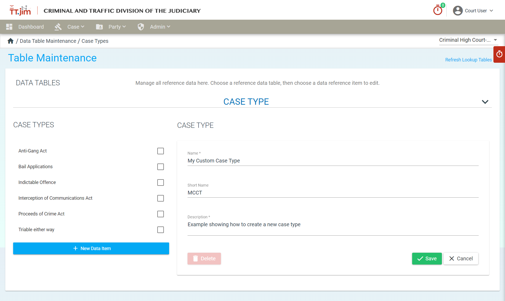

Now, whenever a case is created, you will see the case type we created appear as an option.

There are many other lookup tables such as case phase, case status, initiating document and much more.

# Thank you for Reading!
